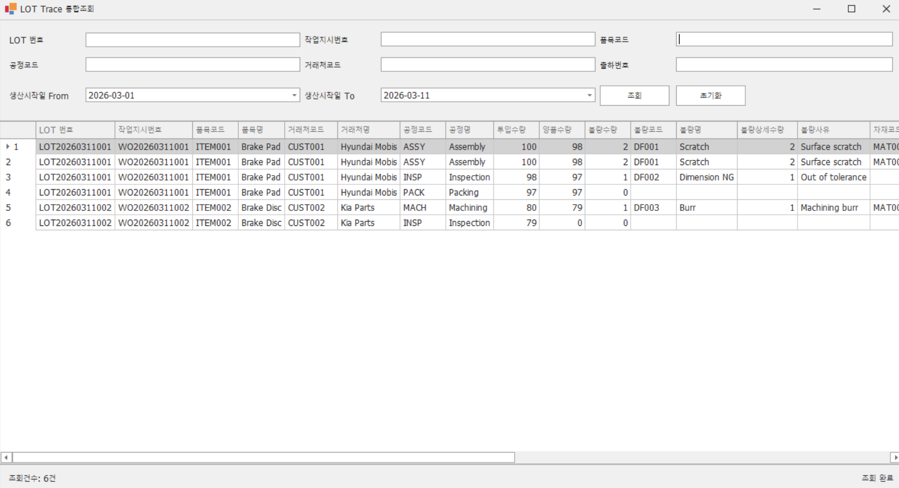

# MiniMes.LotTraceSample

Oracle MES DB의 `SP_SEARCH_LOT_TRACE` 프로시저를 호출해 LOT Trace 통합조회 화면을 표시하는 학습용 WinForms 예제입니다.

## 기술 스택

- C# WinForms
- .NET Framework 4.8
- DevExpress WinForms
- Oracle.ManagedDataAccess
- Oracle XE

## 프로젝트 구조

```text
MiniMes.LotTraceSample
├─ App.config
├─ MiniMes.LotTraceSample.csproj
├─ Program.cs
├─ README.md
├─ Data
│  └─ OracleDbService.cs
├─ Forms
│  ├─ LotTraceForm.cs
│  ├─ LotTraceForm.Designer.cs
│  ├─ MainForm.cs
│  └─ MainForm.Designer.cs
├─ Models
│  └─ LotTraceSearchCondition.cs
├─ Services
│  └─ LotTraceService.cs
└─ Utils
   └─ DBNullHelper.cs
```

## NuGet 패키지

- Oracle.ManagedDataAccess `23.26.100`
- System.Threading.Tasks.Extensions `4.5.4`
- System.Text.Json `8.0.5`
- System.Diagnostics.DiagnosticSource `6.0.2`
- System.Formats.Asn1 `8.0.1`
- System.Memory `4.6.0`
- System.Buffers `4.6.0`
- System.Runtime.CompilerServices.Unsafe `6.1.0`
- System.Numerics.Vectors `4.6.0`
- DevExpress.Data `25.2.5`
- DevExpress.Data.Desktop `25.2.5`
- DevExpress.Drawing `25.2.5`
- DevExpress.Utils `25.2.5`
- DevExpress.Printing.Core `25.2.5`
- DevExpress.Win.Navigation `25.2.5`
- DevExpress.Win.Grid `25.2.5`

## 주요 구현 포인트

- `OracleCommand + RefCursor + OracleDataAdapter.Fill(DataTable)` 방식으로 프로시저 결과를 조회합니다.
- `LotTraceService`에서 검색 DTO를 Oracle 파라미터로 변환합니다.
- 빈 문자열과 nullable 날짜는 `DBNullHelper`를 통해 `DBNull.Value`로 처리합니다.
- GridView 읽기 전용, 자동 폭 해제, 그룹 패널 숨김, 행 번호 표시, 컬럼 Caption 한글화를 적용했습니다.
- 조회 버튼과 Enter 키 모두 조회를 지원합니다.
- 초기화 버튼으로 검색조건, 그리드, 상태영역을 초기화합니다.

## 실행 방법

1. `App.config`의 `MesDb` 연결 문자열을 환경에 맞게 수정합니다.
2. Visual Studio 2022 또는 MSBuild 17.x 환경에서 솔루션을 엽니다.
3. 빌드 후 `MainForm`에서 `LOT Trace 통합조회 열기` 버튼을 눌러 조회 화면을 실행합니다.

## 테스트 메모

- 빌드는 로컬 캐시에 있는 DevExpress/Oracle 패키지 DLL을 참조하도록 구성했습니다.
- Oracle DB 연결과 `SP_SEARCH_LOT_TRACE` 실행은 `MES / mes1234 @ XEPDB1` 기준으로 검증했습니다.
- 현재 샘플 데이터 기준으로 프로시저 호출 시 6건, 30컬럼 반환을 확인했습니다.
- DB 연결이 실패하면 MessageBox와 상태 라벨에 실패 메시지가 표시되도록 구현했습니다.

## 화면 설명



조회 화면은 상단 검색영역, 중앙 결과 그리드, 하단 상태영역의 3단 구조입니다.

- 상단 검색영역: `LOT 번호`, `작업지시번호`, `품목코드`, `공정코드`, `거래처코드`, `출하번호`, `생산시작일 From/To` 입력 후 `조회`, `초기화` 버튼으로 동작합니다.
- 중앙 결과영역: DevExpress `GridControl/GridView`에 LOT 추적 결과를 바인딩하며, 공정별 이력, 불량, 자재 사용, 출하 관련 컬럼을 한 화면에서 확인할 수 있습니다.
- 하단 상태영역: `조회건수: n건`과 `조회 완료`, `조회 결과가 없습니다.`, `조회 실패` 같은 상태 메시지를 표시합니다.

현재 검증 화면 기준으로 `2026-03-01 ~ 2026-03-11` 기간 조회 시 6건이 반환되며, `LOT 번호`, `작업지시번호`, `품목코드`, `품목명`, `거래처`, `공정`, `수량`, `불량`, `자재`, `출하` 정보가 통합 조회됩니다.

## ERD 설명

저장소에는 학습용 미니 MES 데이터 모델 파일 [MES ERD-2.erd](../MES%20ERD-2.erd)와 SQL 스크립트 [MES ERD 쿼리.sql](../MES%20ERD%20쿼리.sql)가 포함되어 있습니다.


LOT Trace 조회 기준 핵심 테이블 관계는 다음과 같습니다.

- `LOT_MASTER`: LOT 기본 정보와 작업지시, 품목, 상태, 시작/종료 일시를 보관합니다.
- `WORK_ORDER`: 작업지시번호와 고객, 품목 정보를 연결합니다.
- `ITEM_MASTER`, `CUSTOMER_MASTER`: 품목과 거래처 마스터를 제공합니다.
- `PROCESS_HISTORY`: 공정별 투입수량, 양품수량, 불량수량, 공정코드/공정명 이력을 보관합니다.
- `DEFECT_LOG`: 공정 이력과 연결되는 불량코드, 불량명, 불량사유를 관리합니다.
- `MATERIAL_USAGE`: 공정 또는 LOT 기준 자재 사용 이력을 관리합니다.
- `SHIPMENT_MASTER`, `SHIPMENT_DETAIL`: 출하번호와 출하수량 정보를 관리합니다.

`SP_SEARCH_LOT_TRACE`는 위 테이블들을 조합해 LOT 기준 통합 추적 결과를 반환하도록 설계된 예제 프로시저입니다.

## 향후 확장 포인트

- 조회 전 필수조건 또는 기간 제한 정책 추가
- Excel 내보내기, 컬럼 선택 저장, 사용자별 검색조건 저장
- 공통 예외 로깅 및 SQL 실행 이력 관리
